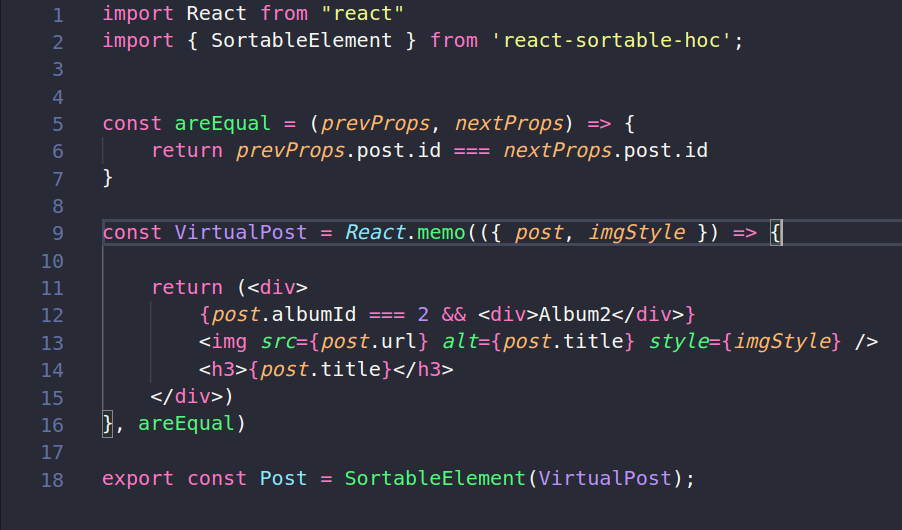
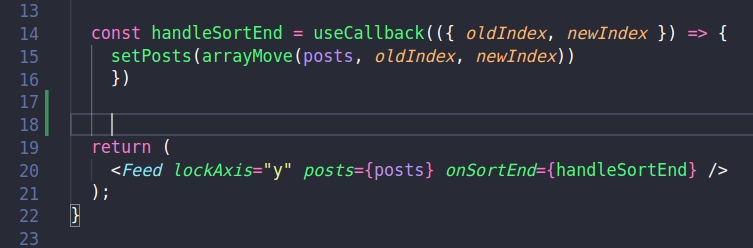

# React-Performance
Projeto feito durante o workshop DoWhile da rocketseat. Nesse workshop foi feito um melhoramento da performance de aplicações no React usando React-window e funções nativas

# :mortar_board: O que foi ensinado
  
  ## Renderizar apenas components que estão aparecendo na tela
  
  - Foi utilizado a função `FixedSizeList` da blibioteca react-window para realizar a renderização apenas dos components que estão na tela. 
  Isso fez a performance da aplicação melhorar muito
  
  ## Como renderizar componentes
  
  - Foi falado sobre o problema da renderezição de components normais do react ao se passar props pra ele, pois quando se modifica essas props, mesmo que essas
  props não afetem propriedades visuais da aplicação, o componente é renderizado novamente. Então no video foi mostrado uma solução que é
  o React.memo, que serve para memorizar o component e so executar denovo esse componente quando as dependencias passadas no segundo parametro da função
  são alteradas. Exemplo:
  
   
  
  ## Renderização Condional no React
  
  - Foi falado também sobre o problema de renderização condicional no react, pois quando voce coloca uma condição fora do return normal da função, o algoritimo do React faz uma comparação de arvore do DOM, e quando ele ve que os elementos que da condição estão posicionados diferente dos elementos que estão no return ele faz toda renderização e recalcula toda a arvore denovo, e isso faz com
  que a perfomance da sua aplicação seja muito prejudicada. A solução para isso então foi o render condicion inline, que seria na mesma linha voce colocar
  a condição, assim o react vai ver que o component na primeira posição pode ser nulo, assim ele não vai precisar recalcular tudo denovo e renderizar o componente
  novamente.
  
  Exmeplo de renderização errada: 
  
   
  
  
  Exemplo de renderização certa:
  
   

## Fazendo a propria condição de renderização

 - É muito importante passar o objeto key para todos os components que são renderizados via props, pois o react faz uma shadow comparation do valor passado no key
 e quando ele ve que o key de um objeto mudou ele renderiza novamente o objeto. Porem tem um problema, o shadow comparation que é feito no React
 se perde quando passamos objetos por props, então nos podemos fazer nossa propria comparação para dizer quando renderizar o componente novamente. Para fazer isso
 nos precisamos passar a condicional que queremos no segundo argumento do React.memo, que foi citado anteriormente. 
 
 
 Exemplo: 
 
 ## Usando useCallBack para memorizar funções
 
 - Foi falado sobre a importancia de colocar o useCallBack em volta das funções que estão dentro de componente do React. Toda vez que um componente é renderizado
 novamente, todas as suas funções são por padrão re-calculadas, e isso querendo ou não faz com que sua aplicação fique mais lenta. Por isso foi criado o useCallBack, que é um jeito de memorizar a função, e com essa função memorizada ela pode ser chamada em qualquer lugar da sua aplicação. O useCallBack é diferente
 do Memo, pois o memo não retorna uma função, ele retorna o valor ou o componente. O useCallBack como o memo tambem possui as dependencias que podem ser passadas
 no 2 parametro da função, e quando essas forem atualizadas a função é recalculada.
 
 Exemplo: 
 
 
 
 obs: Na documentação do React fala que não se deve usar o useCallBack em todas as funções da aplicação, pois muita memoização pode ser prejudicial para a aplicação, então é recomendado usar em funções muito pesadas e em componentes filhos que são atualizados constantemente.  
